---
# Author
author:
  name: Мухина Ксения Николаевна
  email: 1032253531@pfur.ru
  affilation:
    - name: Российский университет дружбы народов
      country: Российская Федерация
      postal-code: 115419
      city: Москва
      address: ул. Орджоникидзе, д. 3

## Title
title: "Отчёт по лабораторной работе №6"
subtitle: "Дисциплина: Архитектура компьютеров"
licence: "CC BY-NC"
---

# Цель работы

Освоить арифметические инструкции языка ассемблера NASM.

# Выполнение лабораторной работы

Далее описываемая работа была выполнена на виртуальной машине Oracle VirtualBox с ОС Linux Ubuntu.

1. Символьные и численные данные в NASM

Перед началом работы создадим каталог lab06, перейдём в него и создадим файл lab6-1.asm.

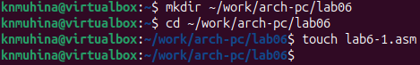{#shot-01 width=70%}

Введём в файл текст программы из листинга, представленного в лабораторной работе, и создадим исполняемый файл.

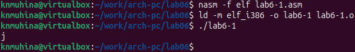{#shot-02 width=70%}

Результат программы - 'j', так как программа складывает двоичные коды символов '6' и '4' (00110110 + 00110100), в результате выдавая сумму 01101010 (106), то есть код символа j.

Изменим некоторые строки программы следующим образом:

{#shot-03 width=70%}

Теперь запустим программу.

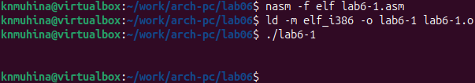{#shot-04 width=70%}

В данном случае результатом программы является код 10, который принадлежит символу перевода строки. Вследствие, при работе программы мы не видим никаких символов.

Чтобы программа корректно работала с числами, в файле in_out.asm реализованы подпрограммы для преобразования ASCII символов в числа и наоборот. Используем эти функции для следующей программы.

Создадим файл lab6-2.asm, в который введём текст программы из листинга, представленного в лабораторной работе, и создадим исполняемый файл.

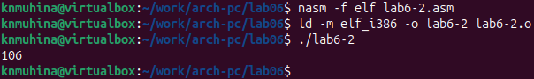{#shot-05 width=70%}

В результате мы получим число 106. В данном случае команда add складывает десятичные коды символов '6' и '4' (54 + 52). В отличие от предыдущей программы, функция iprintLF позволила вывести само число, а не символ, кодом которого оно является.

Изменим некоторые строки программы следующим образом:

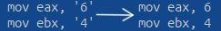{#shot-06 width=70%}

Теперь запустим программу.

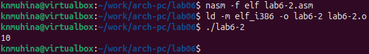{#shot-07 width=70%}

Теперь результатом является число 10, то есть сумма чисел 6 и 4.

Заменим функцию iprintLF на iprint:

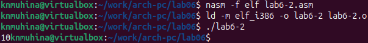{#shot-08 width=70%}

Результат вычислений является таким же, однако изменённая функция не включает в себя перевод строки. По этой причине поле ввода команды появилось на той же строке, что и результат программы.

2. Выполнение арифметических операций в NASM

В качестве примера выполнения арифметических операций приведём программу вычисления остатка в выражении (5*2 + 3)/3.

Создадим файл lab6-3.asm, в который введём текст программы из листинга, представленного в лабораторной работе, и создадим исполняемый файл.

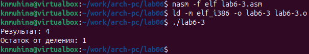{#shot-09 width=70%}

Программа сработала корректно и выдала верный результат.

Изменим программу так, чтобы она выводила остаток, получившийся в результате вычисления выражения (4*6 + 2)/5. Изменим некоторые строки программы следующим образом:

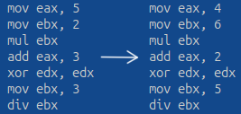{#shot-10 width=70%}

Теперь запустим программу.

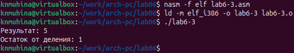{#shot-11 width=70%}

Программа выдала верный результат.

В качестве другого примера рассмотрим программу вычисления варианта задания по номеру студенческого билета. Создадим файл variant.asm, введём в него текст программы из листинга, представленного в лабораторной работе.

Создадим исполняемый файл и запустим программу.

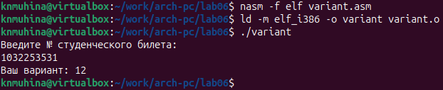{#shot-12 width=70%}

Программа выдала верный результат. В ходе вычислений программа разделила число (номер билета) на 20, получив остаток 11. Далее она прибавила к получившемуся остатку 1, и итоговое число вывела как результат работы программы.

Разберём подробнее листинг программы.

В приведённом в лабораторной работе листинге строки

	mov ecx, x
	mov edx, 80
	call sread

используются для ввода номера студенческого билета с клавиатуры и его записи для последующей работы с номером.

Инструкция 'call atoi' используется для перевода введённого номера, представленного ASCII символами, в число, которое будет использовано для вычисления варианта. Число будет записано в регистр eax как будущее делимое.

Строки

	xor edx, edx ; обнуление для корректной работы div.
	mov ebx, 20 ; запись делителя в ebx.
	div ebx ; деление номера на 20. Остаток от деления записывается в регистр edx.
	inc edx ; увеличение остатка от деления на 1.
	
отвечают за само вычисление варианта. В качестве комментариев даны пояснения к каждой инструкции.

Строки

	mov eax, rem
	call sprint

отвечают за вывод на экран сообщения 'Ваш вариант: '.

Строки

	mov eax, edx
	call iprintLF

отвечают за вывод на экран результата вычислений.

# Задания для самостоятельной работы

Напишем программу для вычисления выражения (8x - 6)/2. Мы выбрали именно данное выражение, так как оно является 12 вариантом задания.

**Листинг 1. Программа variant12.asm**

	%include 'in_out.asm'
	
	SECTION .data
	var: DB 'Вычисление (8x - 6)/2', 0
	msg: DB 'Введите x: ', 0
	res: DB 'Результат: ', 0
	
	SECTION .bss
	x: RESB 80
	
	SECTION .text
	GLOBAL _start
	 _start:
	
	 mov eax, var
	 call sprintLF
	
	 mov eax, msg
	 call sprint

	 mov ecx, x
	 mov edx, 80
	 call sread
	
	 mov eax, x
	 call atoi
	
	 mov ebx, 8
	 mul ebx
	 sub eax, 6
	
	 xor edx, edx
	 mov ebx, 2
	 div ebx
	 mov ebx, eax
	
	 mov eax, res
	 call sprint
	 mov eax, ebx
	 call iprintLF
	
	 call quit

Проверим работу программы для значений 1 и 5.

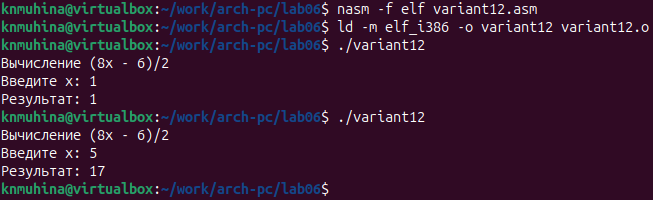{#shot-13 width=70%}

Программа сработала корректно и выдала корректный результат.

# Выводы

В ходе выполнения лабораторной работы мы освоили арифметические инструкции языка ассемблера NASM.

# Список литературы{.unnumbered}

1. Файл ["Лабораторная работа №6. Арифметические операции в NASM.pdf"](https://esystem.rudn.ru/mod/resource/view.php?id=1030554)
