---
# Author
author:
  name: Мухина Ксения Николаевна
  email: 1032253531@pfur.ru
  affilation:
    - name: Российский университет дружбы народов
      country: Российская Федерация
      postal-code: 115419
      city: Москва
      address: ул. Орджоникидзе, д. 3

## Title
title: "Отчёт по лабораторной работе №7"
subtitle: "Дисциплина: Архитектура компьютеров"
licence: "CC BY-NC"
---

# Цель работы

Изучить команды условного и безусловного переходов в NASM. Приобрести навыки написания программ с использованием переходов. Ознакомиться с назначением и структурой файла листинга.

# Выполнение лабораторной работы

Далее описываемая работа была выполнена на виртуальной машине Oracle VirtualBox с ОС Linux Ubuntu.

1. Реализация переходов в NASM

Перед началом работы создадим каталог lab07 и файл lab7-1.asm.

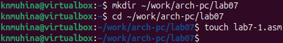{#shot-01 width=70%}

Рассмотрим первый пример использования инструкции jmp. Введём в файл текст программы из листинга, представленного в лабораторной работе, и создадим исполняемый файл.

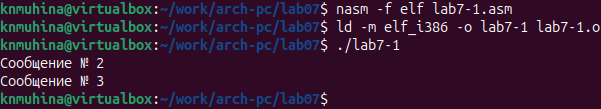{#shot-02 width=70%}

Инструкция jmp _label2 меняет порядок исполнения инструкции и позволяет пропустить вывод первого сообщения, начиная выполнение инструкций с метки _label2.

Инструкция jmp позволяет осуществлять переходы не только вперёд, но и назад. Изменим текст программы следующим образом:

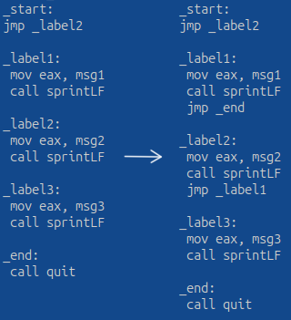{#shot-03 width=70%}

Создадим исполняемый файл.

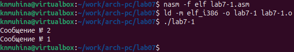{#shot-04 width=70%}

Теперь программа сначала выполняет инструкции, начиная с метки _label2, затем переходит к метке _label1, после чего переходит к метке завершения программы, пропуская сообщение №3.

Снова изменим текст программы:

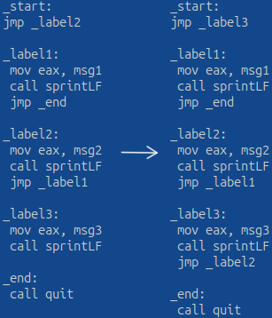{#shot-05 width=70%}

Создадим исполняемый файл.

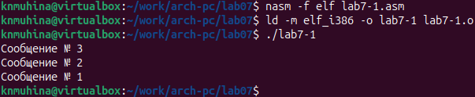{#shot-06 width=70%}

Теперь программа выводит сообщения в обратном порядке.

Рассмотрим одну из инструкций условного перехода на примере следующей программы. Данная программа будет определять и выводить на экран наибольшую из 3 целочисленных переменных A, B и C. Значения A и C уже заданы в программе, а B будет вводиться с клавиатуры.

Создадим файл lab7-2.asm, введём в файл текст программы из листинга, представленного в лабораторной работе, и создадим исполняемый файл. Проверим работу программы, задавая разные значения B.

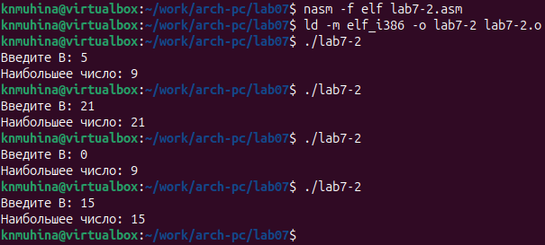{#shot-07 width=70%}

Программа работает корректно.

Обратим внимание, что в данной программе A и C сравниваются как символы, а переменная B и максимум из A и C - как числа. Здесь это сделано для демонстрации того, как сравниваются данные. Можно упростить программу и сравнивать все переменные как символы, либо как числа. Последнее позволит корректно проводить арифметические операции над переменными.

2. Изучение структуры файла листинга.

Чтобы получить файл листинга программы, нужно указать ключ -l и задать имя файла листинга в командной строке. Создадим файл листинга программы из файла lab7-2.asm и тут же откроем его при помощи редактора mcedit.

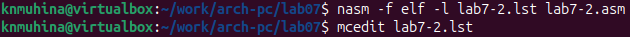{#shot-08 width=70%}

Файл листинга выглядит следующим образом:

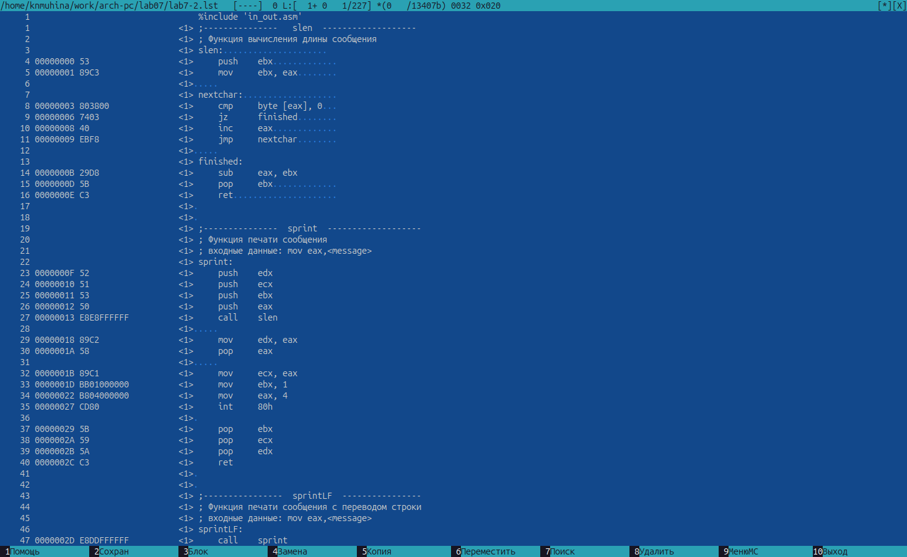{#shot-09 width=70%}

Сразу обратим внимание, что в файле листинга номер строки листинга не всегда совпадает с номером строки текста программы. Разберём некоторые строки листинга.

Строка листинга №1 указывает на строку текста программы №1, подключающий к программе lab7-2 подпрограммы из файла in_out.asm и не содержит других данных. Далее в листинге описываются подпрограммы из самого файла.

Разберём строки листинга самого текста программы lab7-2. Строки листинга

	6 00000035 32300000                A dd '20'
	7 00000039 35300000                C dd '50'

указывают подробную информацию по следующей структуре: номер строки текста программы, адрес (смещение машинного кода от начала сегмента .data), машинный код строки, представленный шестнадцатеричной последовательностью, и сам исходный текст программы - задание переменных A и C.

Строка листинга

	37 0000012F E868FFFFFF                call atoi

по такой же структуре указывает подробную информацию о инструкции вызова функции atoi.

Листинг программы также может содержать информацию о возможных предупреждениях и ошибках, возникающих в ходе выполнения инструкций. Откроем файл с программой и из одной из инструкций удалим операнд.

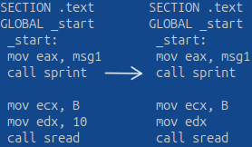{#shot-10 width=70%}

Заново создадим листинг программы и откроем его.

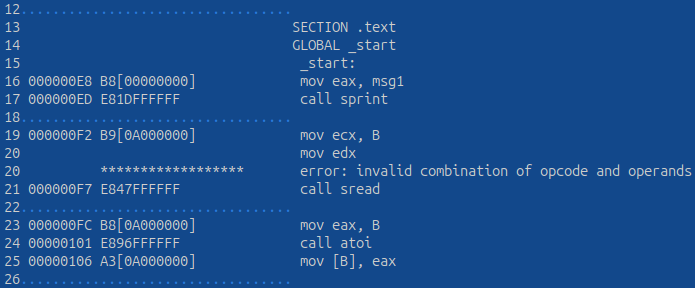{#shot-11 width=70%}

К строке текста программы №20 листинг добавил примечание об ошибке в некорректной записи операндов в инструкции.

# Задания для самостоятельной работы

Создадим файл task1.asm и напишем программу нахождения наименьшей из 3 целочисленных переменных. Значения переменных были выбраны в соответствии с вариантом, полученным при выполнении лабораторной работы №6.

**Листинг 1. Программа task1.asm**

	%include 'in_out.asm'

	SECTION .data
	msg DB 'Наименьшее число: ', 0h
	A dd '99'
	B dd '29'
	C dd '26'

	SECTION .bss
	min resb 10

	SECTION .text
	GLOBAL _start
	 _start:
	  mov ecx, [A]
	  mov [min], ecx

	  mov eax, min
	  call atoi
	  mov [min], eax

	  mov eax, B
	  call atoi
	  mov [B], eax

	  cmp [B], ecx
	  jg check_C
	  mov ecx, [B]
	  mov [min], ecx

	  check_C:
	   mov eax, C
	   call atoi
	   mov [C], eax

	   mov ecx, [min]
	   cmp [C], ecx
	   jg fin
	   mov ecx, [C]
	   mov [min], ecx

	  fin:
	   mov eax, msg
	   call sprint
	   mov eax, [min]
	   call iprintLF
	   call quit

Создадим исполняемый файл и проверим работу программы.

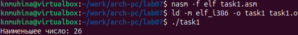{#shot-12 width=70%}

Программа работает корректно.

Теперь создадим файл task2.asm и напишем программу вычисления значения заданной функции. Вид функции определён вариантом, полученным при выполнении лабораторной работы №6.

**Листинг 2. Программа task2.asm**

	%include 'in_out.asm'

	SECTION .data
	var DB 'Вычисление функции.', 0h
	msg1 DB 'Введите x: ', 0h
	msg2 DB 'Введите a: ', 0h
	msgR DB 'Результат: ', 0h
	C dd 5

	SECTION .bss
	X resb 10
	A resb 10
	res resb 40

	SECTION .text
	GLOBAL _start
	 _start:
	 mov eax, var
	 call sprintLF

	 mov eax, msg1
	 call sprint

	 mov ecx, X
	 mov edx, 10
	 call sread

	 mov eax, X
	 call atoi
	 mov [X], eax

	 mov eax, msg2
	 call sprint

	 mov ecx, A
	 mov edx, 10
	 call sread

	 mov eax, A
	 call atoi
	 mov [A], eax

	 mov ecx, [C]
	 cmp ecx, [X]
	 jg func

	 mov eax, [X]
	 sub eax, [C]
	 mov [res], eax
	 jmp _res

	 func:
	  mov ebx, [X]
	  mov eax, [A]
	  mul ebx
	  mov [res], eax

	 _res:
	  mov eax, msgR
	  call sprint
	  mov eax, [res]
	  call iprintLF
	  call quit

Создадим исполняемый файл и проверим работу программы на основе значений из таблицы, представленной в лабораторной работе.

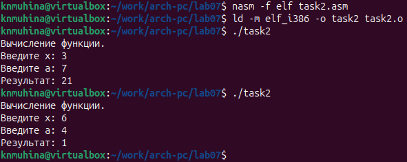{#shot-13 width=70%}

Программа работает корректно.

# Выводы

В ходе выполнения лабораторной работы мы изучили команды условного и безусловного переходов в NASM, приобрели навыки написания программ с использованием переходов и ознакомились с назначением и структурой файла листинга.

# Список литературы{.unnumbered}

1. Файл ["Лабораторная работа №7. Команды безусловного и условного переходов в Nasm. Программирование ветвлений.pdf"](https://esystem.rudn.ru/mod/resource/view.php?id=1030555)
