---
# Author
author:
  name: Мухина Ксения Николаевна
  email: 1032253531@pfur.ru
  affilation:
    - name: Российский университет дружбы народов
      country: Российская Федерация
      postal-code: 115419
      city: Москва
      address: ул. Орджоникидзе, д. 3

## Title
title: "Отчёт по лабораторной работе №8"
subtitle: "Дисциплина: Архитектура компьютеров"
licence: "CC BY-NC"
---

# Цель работы

Приобрести навыки написания программ с использованием циклов и с обработкой аргументов командной строки.

# Выполнение лабораторной работы

Далее описываемая работа была выполнена на виртуальной машине Oracle VirtualBox с ОС Linux Ubuntu.

1. Реализация циклов в NASM

Перед началом работы создадим каталог lab08 и файл lab8-1.asm.

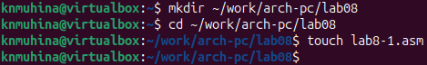{#shot-01 width=70%}

Рассмотрим первый пример использования инструкции loop. Введём в файл текст программы из листинга, представленного в лабораторной работе, и создадим исполняемый файл.

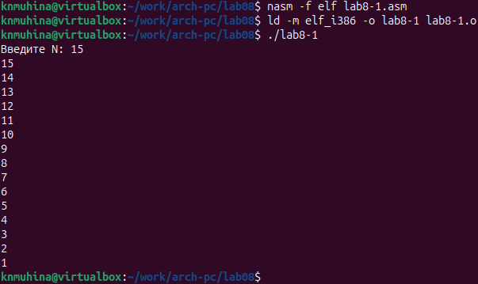{#shot-02 width=70%}

Инструкция loop использует регистр ecx в качестве счётчика и на каждом шаге уменьшает значение на 1.

Изменения в регистре ecx внутри цикла могут привести к некорректной работе программы. Изменим текст программы следующим образом:

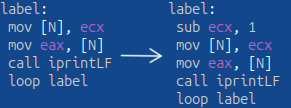{#shot-03 width=70%}

Создадим исполняемый файл и запустим его.

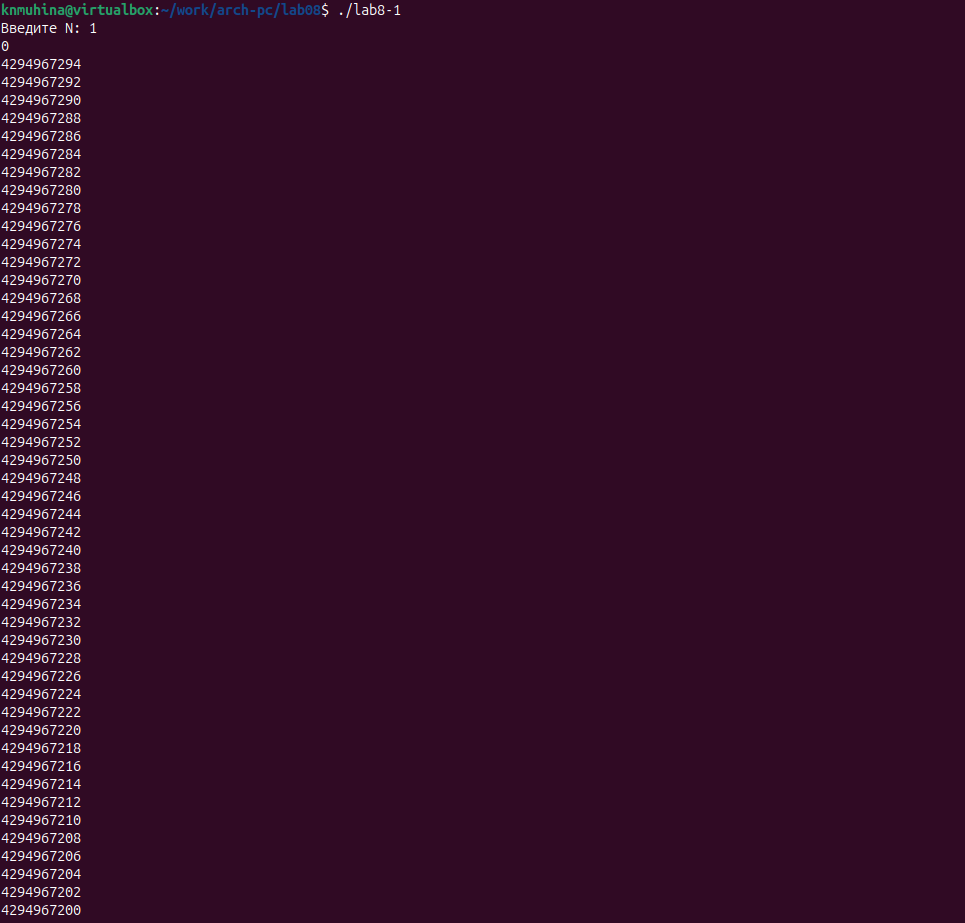{#shot-04 width=70%}

В ходе работы программы после введения числа 1 программа предсказуемо выдаёт 0, затем при запуске нового цикла значение регистра становится меньше нуля, вследствие чего в качестве следующего значения он берёт максимально возможное положительное число, и начинает отсчёт с него.

При вводе чётного значения программа будет пропускать нечётные шаги, следовательно, в данной программе число проходов цикла никогда не будет соответствовать заданному значению N.

Для корректной работы программы такого вида можно использовать стек. Снова изменим текст программы:

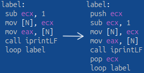{#shot-05 width=70%}

Создадим исполняемый файл и запустим его.

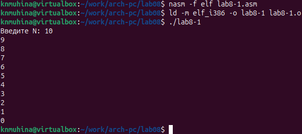{#shot-06 width=70%}

Теперь число проходов цикла соответствует заданному N, так как стек позволяет сохранить значение счётчика цикла.

2. Обработка аргументов командной строки

В качестве примера обработки аргументов командной строки рассмотрим программу, выводящую на экран заданные аргументы. Создадим файл lab8-2.asm, введём в файл текст программы из листинга, представленного в лабораторной работе, и создадим исполняемый файл.

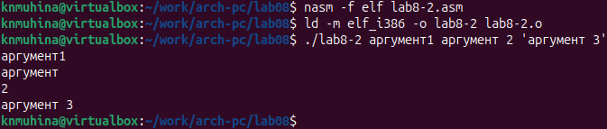{#shot-07 width=70%}

Программа обработала 4 аргумента - 'аргумент1', 'аргумент', '2' и 'аргумент 3'.

Рассмотрим другой пример: программу, которая выводит сумму чисел, которые задаются как аргументы командной строки. Создадим файл lab8-3.asm, введём в файл текст программы из листинга, представленного в лабораторной работе, и создадим исполняемый файл.

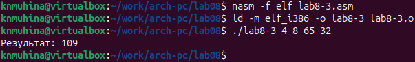{#shot-08 width=70%}

Программа работает корректно.

Изменим текст программы так, чтобы программа выводила произведение аргументов.

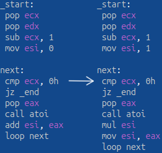{#shot-09 width=70%}

Создадим исполняемый файл и запустим его.

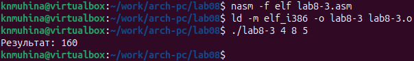{#shot-10 width=70%}

Программа работает корректно.

# Задания для самостоятельной работы

Создадим файл task.asm и напишем программу вычисления суммы значений заданной функции. Вид функции определён вариантом, полученным при выполнении лабораторной работы №6.

**Листинг 1. Программа task.asm**

	%include 'in_out.asm'

	SECTION .data
	msg db 'Функция: f(x) = 15x - 9', 0h
	msgR db 'Результат: ', 0h

	SECTION .text
	global _start
	_start:
	 pop ecx
	 pop edx
	 sub ecx, 1
	 mov esi, 0

	next:
	 cmp ecx, 0
	 jz _end
	 pop eax
	 call atoi
	 mov ebx, 15
	 mul ebx
	 sub eax, 9
	 add esi, eax
	 loop next

	_end:
	 mov eax, msg
	 call sprintLF
	 mov eax, msgR
	 call sprint
	 mov eax, esi
	 call iprintLF
	 call quit

Создадим исполняемый файл и проверим работу программы для различных наборов аргументов.

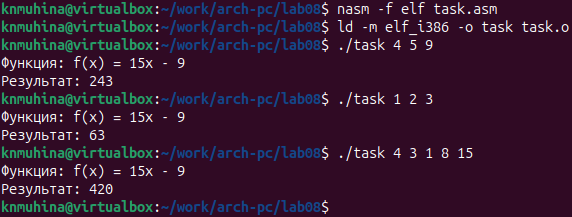{#shot-11 width=70%}

Программа работает корректно.

# Выводы

В ходе выполнения лабораторной работы мы приобрели навыки написания программ с использованием циклов и с обработкой аргументов командной строки.

# Список литературы{.unnumbered}

1. Файл ["Лабораторная работа №8. Программирование цикла. Обработка аргументов командной строки.pdf"](https://esystem.rudn.ru/mod/resource/view.php?id=1030556)
