---
# Author
author:
  name: Мухина Ксения Николаевна
  email: 1032253531@pfur.ru
  affilation:
    - name: Российский университет дружбы народов
      country: Российская Федерация
      postal-code: 115419
      city: Москва
      address: ул. Орджоникидзе, д. 3

## Title
title: "Отчёт по лабораторной работе №9"
subtitle: "Дисциплина: Архитектура компьютеров"
licence: "CC BY-NC"
---

# Цель работы

Приобрести навыки написания программ с использованием подпрограмм. Ознакомиться с методами отладки при помощи GDB и его основными возможностями.

# Выполнение лабораторной работы

Далее описываемая работа была выполнена на виртуальной машине Oracle VirtualBox с ОС Linux Ubuntu.

1. Реализация подпрограмм в NASM

Перед началом работы создадим каталог lab09 и файл lab09-1.asm.

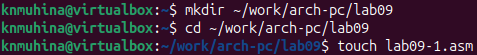{#shot-01 width=70%}

Рассмотрим в качестве примера программу вычисления выражения 'f(x) = 2x + 7' с помощью подпрограммы _calcul. Значение x вводится с клавиатуры, а процесс вычисления проходит в подпрограмме. Введём в файл текст программы из листинга, представленного в лабораторной работе, и создадим исполняемый файл.

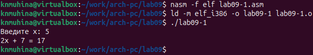{#shot-02 width=70%}

В данной программе функция 'call _calcul' вызывает данную подпрограмму, выполняет инструкции внутри неё, затем при помощи ret выходит из подпрограммы и продолжает выполнение с инструкции, следующей за call. Остальные подпрограммы, извлекаемые из файла in_out.asm, работают таким же образом. Предназначения данных подпрограмм уже известны.

Теперь изменим текст программы, добавив в подпрограмму _calcul другую подпрограмму - _subcalcul, где x становится переменной в выражении 'g(x) = 3x - 1', а результат g(x) - переменной f(x).

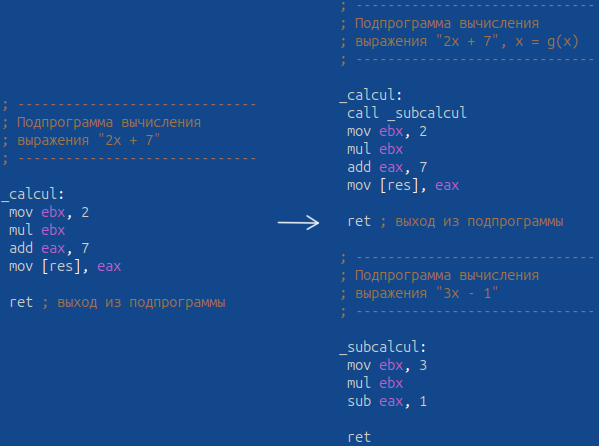{#shot-03 width=70%}

Создадим исполняемый файл и запустим его.

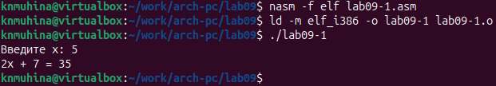{#shot-04 width=70%}

Результат программы корректный.

2. Отладка программам с помощью GDB

Создадим файл lab09-2.asm, введём в файл текст программы из листинга, представленного в лабораторной работе, и создадим исполняемый файл. Для работы с GDB в исполняемый файл необходимо добавить отладочную информацию, поэтому проведём трансляцию с ключом 'g'. Сам исполняемый файл загрузим в отладчик GDB.

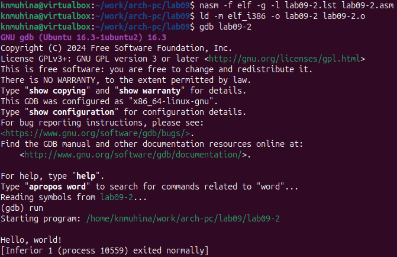{#shot-05 width=70%}

Программа работает корректно, выводя сообщение 'Hello, world!'.

Для более подробного анализа программы установим брейкпоинт на метку _start и запустим программу.

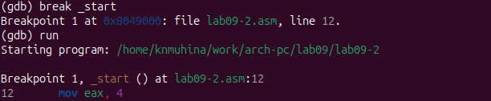{#shot-06 width=70%}

Посмотрим дизассемблированный код программы при помощи disassemble, начиная с метки _start.

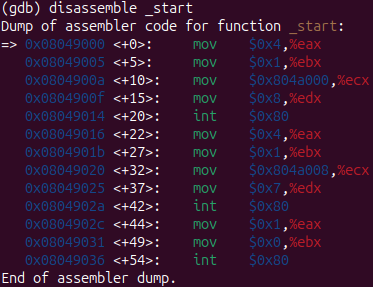{#shot-07 width=70%}

В данном случае команды отражаются с синтаксисом ATT.

Переключим синтаксис отображения команд на Intel при помощи команды 'set disassembly-flavor Intel' и снова посмотрим код программы.

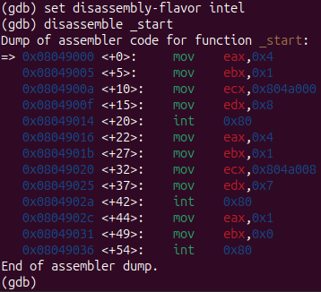{#shot-08 width=70%}

Несмотря на одинаковый результат, синтаксисы имеют некоторую разницу в отображении. В отличие от кода в синтаксисе ATT, в Intel-синтаксисе операнды идут в порядке назначение-источник, а не наоборот. Также сами операнды записываются без префиксов.

Включим режим псевдографики для более удобного анализа программы при помощи 'layout asm' и 'layout regs'. Теперь интерфейс будет выглядеть следующим образом:

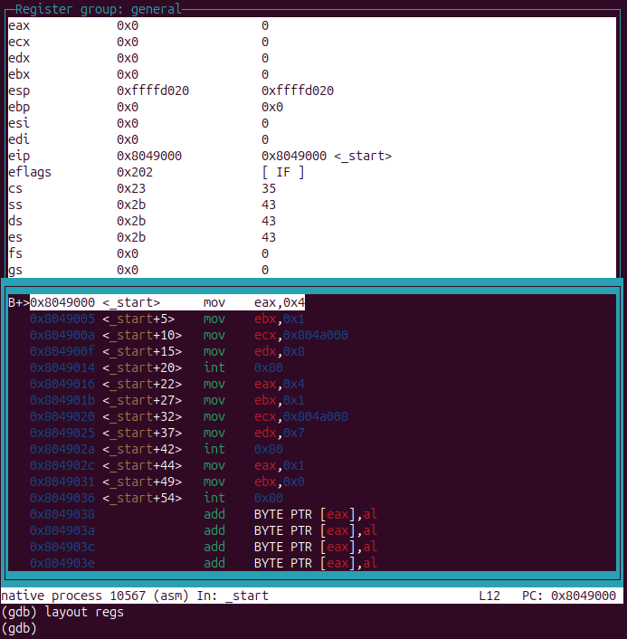{#shot-09 width=70%}

В этом режиме верхняя часть окна выделена под отображение информации о регистрах, средняя - отображение дизассемблированного кода, а нижняя часть доступная для ввода команд.

2.1. Добавление точек останова

Установить точку останова (брейкпоинт) можно командой break (или b). Типичный аргумент команды - место установки. Его можно задать как номер строки программы, имя метки или адрес. Перед адресом ставится знак "звёздочки" для избежания путаницы с номерами.

На одном из предыдущих шагов был установлен брейкпоинт по имени метки. Проверим это при помощи 'info breakpoints' (или 'i b')

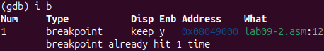{#shot-10 width=70%}

Установим ещё один брейкпоинт по адресу инструкции, который можно увидеть в средней части экрана в левом столбце инструкции. Определим адрес инструкции 'mov ebx, 0x0' и установим брейкпоинт. Затем снова посмотрим информацию о брейкпоинтах.

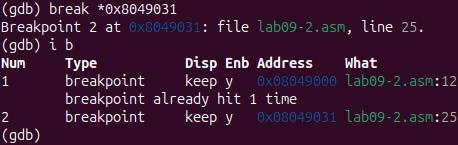{#shot-11 width=70%}

Теперь установлены два брейкпоинта - по метке _start и по адресу 0x8049031.

2.2. Работа с данными программы в GDB

Отладчик может показывать содержимое ячеек памяти и регистров, а при необходимости позволяет вручную изменить значения регистров и переменных.

Посмотрим содержимое регистров через команду 'info registers' (или 'i r').

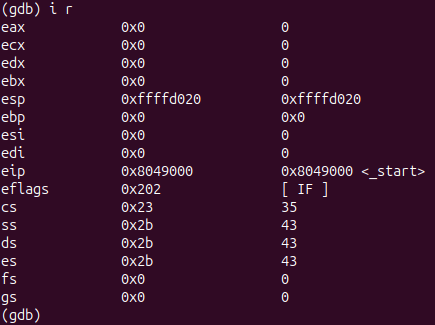{#shot-12 width=70%}

Выполним 5 инструкций с помощью команды 'stepi 5' (или 'si 5') и проверим значения регистров на наличие изменений.

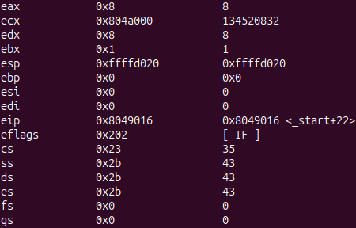{#shot-13 width=70%}

Как мы видим, изменились значения регистров eax, ebx, ecx, edx и eip.

Для отображения содержимого памяти можно использовать команду 'x <адрес>', которая выдаёт содержимое ячейки по указанному адресу. Формат вывода данных можно задать после имени команды через косую черту: 'x/NFU <адрес>'.

С помощью команды 'x &<имя переменной>' можно посмотреть содержимое переменной.

Посмотрим значение переменной msg1 по имени, а переменной msg2 - по адресу. Адрес msg2 определим по дизассемблированной инструкции 'mov ecx, msg2'.

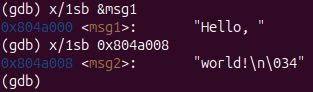{#shot-14 width=70%}

С помощью команды set можно изменить значение для регистра или ячейки памяти, задав в качестве аргумента имя регистра или адрес. Для имени регистра команда будет выглядеть как 'set $<имя регистра>', для адреса - как 'set {type}<адрес>'. В обоих случаях обязательно указываются префикс $ и тип данных соответственно.

Изменим первые символы в переменных msg1 и msg2, задав как аргументы их адреса.

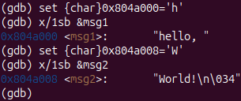{#shot-15 width=70%}

Для просмотра значений регистров используется команда 'print /F <val>' (или 'p/F <val>'). Перед именем регистра также ставится префикс $.

Выведем значение регистра edx в шестнадцатеричном, в двоичном форматах и в символьном виде.

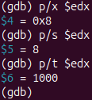{#shot-16 width=70%}

С помощью set изменим значение регистра ebx.

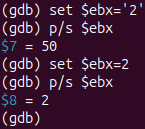{#shot-17 width=70%}

Разница вывода обуславливается тем, что сначала мы меняем значение регистра на символ '2', код которого выводится при применении p/s. Затем мы меняем значение на число 2, которое и отображается при выводе команды p/s.

Завершим выполнение программы при помощи continue (или c) и выйдем из GDB.

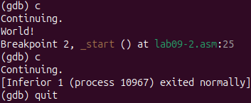{#shot-18 width=70%}

2.3. Обработка аргументов командной строки в GDB

Скопируем файл lab8-2.asm, созданный в ходе выполнения лабораторной работы №8 в файл с именем lab09-3.asm. Создадим исполняемый файл и загрузим его в gdb, задав аргументы 'аргумент1', 'аргумент', '2' и 'аргумент 3' с использованием ключа --args.

Также перед началом анализа программы установим брейкпоинт в метке _start и запустим её.

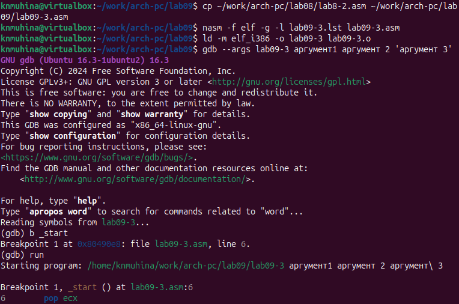{#shot-19 width=70%}

Как отмечалось в предыдущей работе, при запуске программы заданные аргументы загружаются в стек. Исследуем расположение аргументов в стеке.

Адрес вершины стека хранится в регистре esp, и по этому адресу располагается число, равное количеству аргументов (включая имя программы). Просмотрим его, используя команду 'x/x'.

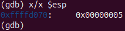{#shot-20 width=70%}

Мы убедились, что число аргументов равно 5: в него входят имя программы lab09-3 и непосредственно 4 заданных аргумента.

По адресу [esp+4] располагается адрес имени программы, по адресу [esp+8] - адрес первого аргумента, и т.д. Посмотрим остальные позиции стека через команду 'x/s *(void**)(&<адрес>)'.

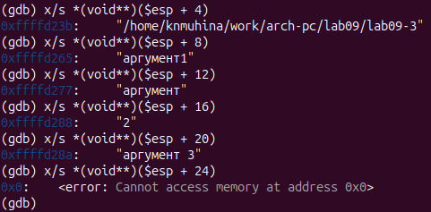{#shot-21 width=70%}

Шаг изменения адреса равен 4, так как каждый аргумент функции занимает в стеке 4 байта.

# Задания для самостоятельной работы

Изменим программу, написанную по заданию для самостоятельной работы из лабораторной работы №8, реализовав вычисление значения функции f(x) как подпрограмму.

**Листинг 1. Программа task1.asm**

	%include 'in_out.asm'

	SECTION .data
	msg db 'Функция: f(x) = 15x - 9', 0h
	msgR db 'Результат: ', 0h

	SECTION .text
	global _start
	_start:
	 pop ecx
	 pop edx
	 sub ecx, 1
	 mov esi, 0

	next:
	 cmp ecx, 0
	 jz _end
	 pop eax
	 call atoi
	 call _calc
	 loop next

	_end:
	 mov eax, msg
	 call sprintLF
	 mov eax, msgR
	 call sprint
	 mov eax, esi
	 call iprintLF
	 call quit

	_calc:
	 mov ebx, 15
	 mul ebx
	 sub eax, 9
	 add esi, eax

	 ret

Создадим исполняемый файл и проверим работу программы для набора аргументов.

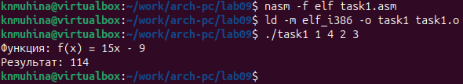{#shot-22 width=70%}

Программа работает корректно.

В листинге, представленном в задании 2, приведена программа вычисления выражения '(3 + 2)*4 + 5'. Проверим, что при запуске данная программа даёт неверный результат. Введём в файл task2.asm текст программы из листинга и создадим исполняемый файл.

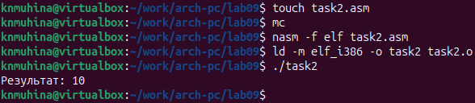{#shot-23 width=70%}

Программа действительно даёт неверный результат.

Проанализируем программу с помощью отладчика GDB. Открыв программу через отладчик и проверив изменения значений регистров, постепенно выполняя инструкции при помощи si, мы обнаружили следующее некорректное изменение значений:

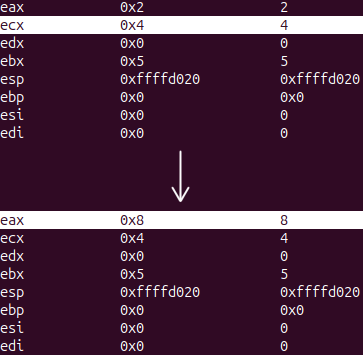{#shot-24 width=70%}

При выполнении инструкции 'mov ecx, 4' программа ожидаемо записывает значение 4 в регистр ecx. Однако при выполнении 'mul ecx' значение умножается не на 5 (как оно изначально должно было быть), а на 2 - текущее значение регистра eax. Это связано с тем, что при складывании значений eax и ebx результат записался в ebx и не был перемещён в eax. В итоге значение ebx остаётся неизменным.

Ещё одной ошибкой является вывод на экран результата значения, записанного в регистр ebx, к которому вследствие предыдущей ошибки вычисления было прибавлено 5.

Изменим текст программы таким образом, чтобы программа выводила верный результат.

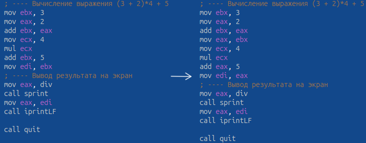{#shot-25 width=70%}

Создадим исполняемый файл и проверим работу программы.

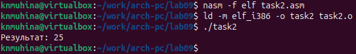{#shot-26 width=70%}

Теперь программа работает корректно.

# Выводы

В ходе выполнения лабораторной работы мы приобрели навыки написания программ с использованием подпрограмм и ознакомились с методами отладки при помощи GDB и его основными возможностями.

# Список литературы{.unnumbered}

1. Файл ["Лабораторная работа №9. Понятие подпрограммы. Отладчик GDB.pdf"](https://esystem.rudn.ru/mod/resource/view.php?id=1030557)
