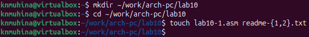
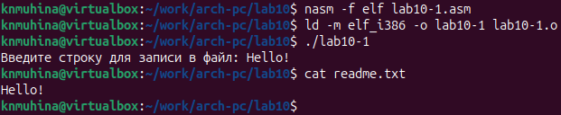
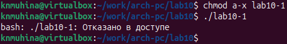
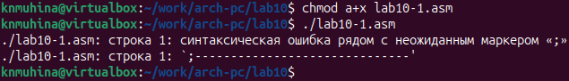
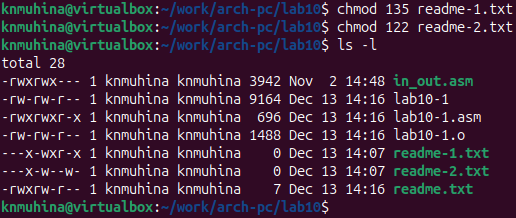
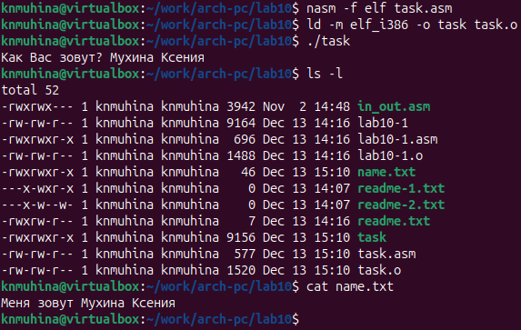

---
# Author
author:
  name: Мухина Ксения Николаевна
  email: 1032253531@pfur.ru
  affilation:
    - name: Российский университет дружбы народов
      country: Российская Федерация
      postal-code: 115419
      city: Москва
      address: ул. Орджоникидзе, д. 3

## Title
title: "Отчёт по лабораторной работе №10"
subtitle: "Дисциплина: Архитектура компьютеров"
licence: "CC BY-NC"
---

# Цель работы

Приобрести навыки написания программ для работы с файлами.

# Выполнение лабораторной работы

Далее описываемая работа была выполнена на виртуальной машине Oracle VirtualBox с ОС Linux Ubuntu.

Перед началом работы создадим каталог lab10 и файлы lab10-1.asm, readme-1.txt и readme-2.txt.

{#shot-01 width=70%}

Введём в файл lab10-1.asm текст программы из листинга, представленного в лабораторной работе, и создадим исполняемый файл.

Перед созданием исполняемого файла были внесены некоторые изменения в исходный код, а точнее дополнение командами

	 mov ecx, 0777o
	 mov ebx, filename
	 mov eax, 8
	 int 80h

в связи с отсутствием в описании лабораторной работы и листинге каких-либо инструкций по созданию файла readme.txt.

Проверим работу программы на примере текста 'Hello!'.

{#shot-02 width=70%}

Программа работает корректно, записывая в файл введённое сообщение 'Hello!'.

Изменим права доступа к изменяемому файлу при помощи chmod, запретив его выполнение, и попытаемся запустить программу.

{#shot-03 width=70%}

Как мы видим, команда поставила запрет на выполнение файла для любых пользователей, в том числе и владельца.

Теперь изменим права доступа к файлу lab10-1.asm с исходным текстом программы, добавив права на исполнение, и выполним файл.

{#shot-04 width=70%}

Мы смогли выполнить файл, что показывает текст синтаксической ошибки.

В соответствии с правами доступа, представленными в символьном и двоичном видах в таблице, предоставим данные права доступа к файлам readme-1.txt и readme-2.txt соответственно. Проверим результат работы с помощью команды ls -l.

{#shot-05 width=70%}

Для удобства и компактности команд права были заданы в восьмеричном виде. Заданные права полностью соответствуют представленному варианту 12 в таблице.

# Задания для самостоятельной работы

Создадим файл task.asm и напишем в нём программу по заданному алгоритму: вывод сообщения "Как Вас зовут?", ввод фамилии и имени, создание файла, запись в файл сообщения "Меня зовут" и введённой строки, закрытие файла.

**Листинг 1. Программа task.asm**

	%include 'in_out.asm'

	SECTION .data
	filename db 'name.txt', 0h
	msg db 'Как Вас зовут? ', 0h
	msg1 db 'Меня зовут ', 0h

	SECTION .bss
	name resb 255

	SECTION .text
	GLOBAL _start
	_start:
	 mov eax, msg
	 call sprint

	 mov ecx, name
	 mov edx, 255
	 call sread

	 mov ecx, 0777o
	 mov ebx, filename
	 mov eax, 8
	 int 80h

	 mov esi, eax

	 mov eax, msg1
	 call slen

	 mov edx, eax
	 mov ecx, msg1
	 mov ebx, esi
	 mov eax, 4
	 int 80h

	 mov eax, name
	 call slen

	 mov edx, eax
	 mov ecx, name
	 mov ebx, esi
	 mov eax, 4
	 int 80h

	 mov ebx, esi
	 mov eax, 6
	 int 80h

	 call quit

Создадим исполняемый файл и проверим работу. Также проверим наличие файла и его содержимое.

{#shot-06 width=70%}

Программа работает корректно.

# Выводы

В ходе выполнения лабораторной работы мы приобрели навыки написания программ для работы с файлами.

# Список литературы{.unnumbered}

1. Файл ["Лабораторная работа №10. Работа с файлами средствами Nasm.pdf"](https://esystem.rudn.ru/mod/resource/view.php?id=1030558)
